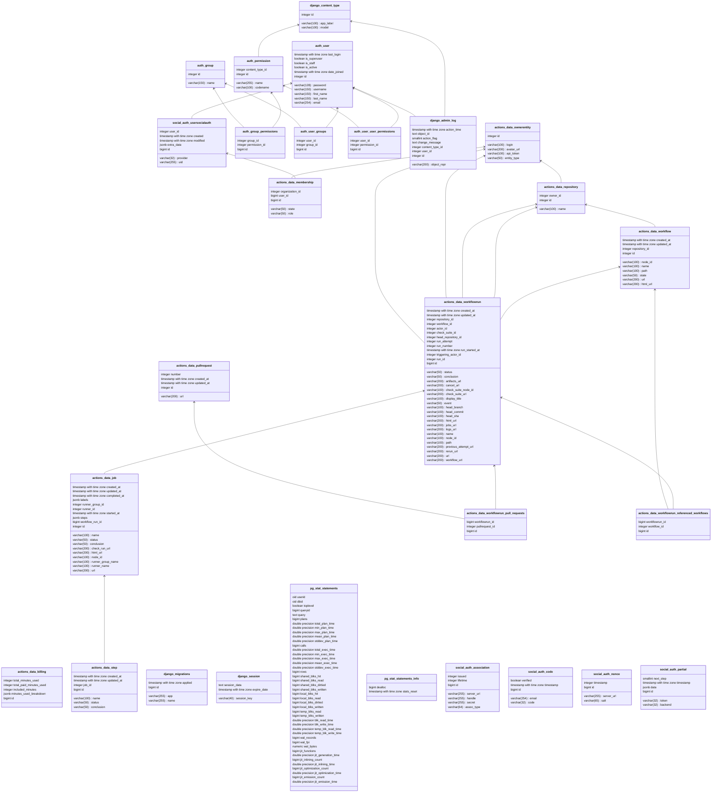

# BuildBudget

## Commands

Connect to prod DB

```bash
heroku pg:psql postgresql-contoured-46009 --app actions-insider
```

Pull prod DB to local DB

```bash
heroku pg:pull postgresql-contoured-46009 postgres://edu@localhost:5432/actions_insider --app actions-insider
```

Run tests

```bash
./scripts/test_and_report.sh
```

## Environment Variables

Here's a list of environment variables that need to be set in order to run the application.

 - DEBUG: Set to `True` to enable debug mode.



